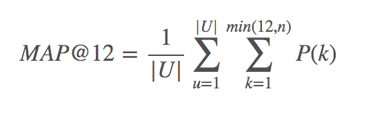

# Project Question #

**What question are you trying to solve**

  Can we predict which recommended  content each user will click?

**What additional information you would like to learn ?**

  What are the significant features that drive the likely hood of user clicking the recommended content indicating association?

**What data you will use ?**

  Outbrain's two weeks of data from 14-Jun-2016 and 28-jun-2016 provided on kaggle. This is a very large relational set ( 2B rows and 100GB uncompressed). If the large amount of data is unmanageable the data size may be reduced  1/10th so the project could be completed in the given timeframe.
  
  Link to acquire the data: <https://www.kaggle.com/c/outbrain-click-prediction/data>.  

**How the model would be evaluated ?**

  The prediction of the models would be evaluated on test data according to the Mean Average Precision @12 (MAP@12): 
  
  . 
 
  where |U| is the number of display_ids, P(k) is the precision at cutoff k, n is the number of predicted ad_ids.   

**What is the timeframe?**

  Plan is to complete the project by 8 Nov' 17 before peer review.
  
**Why do I want to answer this question?**
  
  I am very interested in learning more about targeted online advertisement. It involves working with large amount of dataset and predicting click through rate of ads presented to the user thus providing a better experience. Given the domain is directly applicable to my job I am very interested to solve this and apply learnings to my work. The size of the data would also pose interesting challenges and would require data wrangling, feature engineering and model building skills which I am interested to develop my expertise on.
